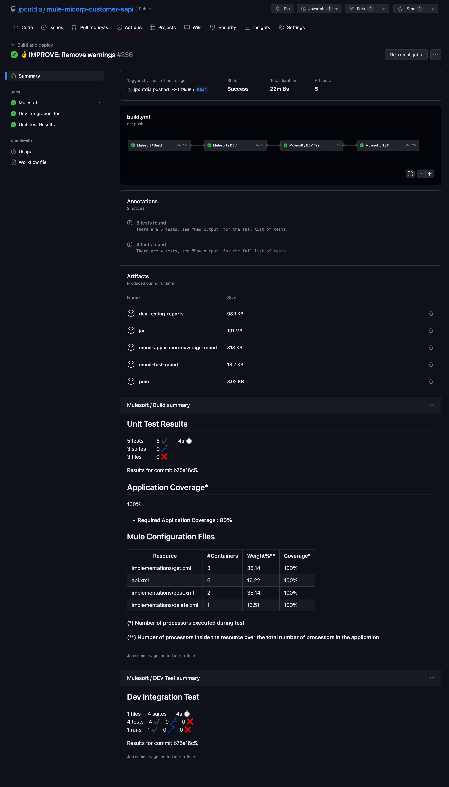

# Mulesoft DevOps Tools
DevOps centralized hub that provides reusable workflows and actions for building CICD pipelines with a detached multi-environment configuration and secrets management.

## Table of contents
1. [Features](#features)
1. [Pipeline resources](#pipeline-resources)
1. [Azure KeyVault](#workflows) 
1. [Repository: mulesoft-configurations](#repository-mulesoft-configurations) 
1. [Repository: mulesoft-pipeline](#repository-mulesoft-pipeline) 
    1. [Workflows](#workflows)
    2. [Actions](#actions)
1. [Github Secrets](#github-secrets)
1. [Examples](#examples)

## Features

- Standardization of source code layout. Enforces Github and AnypointExchange documentation.
- Pipeline created with reusable components with simple configuration in yaml files. No need to hardcode any service specific data.
- Creation of code repository bages for test cases and code coverage.
- Anypoint Exchange as an artifact repository.
- Configuration Management using configuration repositories and secrets.
- Uses Azure KeyVault as a secret managment, almost a free aproach. No need to use anymore security configuration files in code.
- Separation of roles: Security Manager configures the KeyVault, and DevOps engeniers responsible of service configuration.
- Integration testing with Mulesoft Blackbox Automated Testing (BDD tool), say goodby to postman or manual human QA test.
- Works great with free personal or enterprise github accounts, with private or public repositories
- Ready to use for Cloudhub 1 and GovCloud, Cloudhub 2 is coming. The current baseline makes easy extensible for runtime fabric or docker images

## Pipeline resources

Next is the list with the resources required by the pipeline:

- Azure Keyvault: A KeyVualt to store all secrets required by services and pipeline
- Github respository: mulesoft-configurations. Configuration repository for services
- Github respository: mulesoft-pipeline. Reusable workflows and actions (this repository)
- Github Gist: A Gist to store to code badges: code coverage, test unit, etc.
- Github Secrets: Secrets stored in Github that allows the connection with Azure Keyvault and Gist

## Azure KeyVault

A KeyVualt to store all secrets required by services and pipeline. Mandatory secrets:
| Secret               | Description |
| -------------------- | ----------- |
| github-configurations-accesstoken | Personal access token for repository: mulesoft-configurations.|
| github-gist-accesstoken | Personal access token for gist access.|

## Repository mulesoft-configurations

Repository with the configuration for the pipeline and services. The mandatory files are:

| File                 | Description |
| -------------------- | ----------- |
| secrets-map.txt | Configuration file with the map rules between environment variables and secrets.|
| settings.xml | Maven settings file used to build mulesoft assets|

## Repository mulesoft-pipeline
The Pipeline Repository is a centralized hub for building and deploying software services. It offers reusable workflows and actions that streamline development processes and adhere to best practices. The repository aims to enhance efficiency, reliability, and collaboration throughout the software development lifecycle.

Teams can access meticulously crafted workflows and actions covering various aspects of software delivery. These automate tasks such as building, testing, and deploying services, saving time and ensuring reproducibility. The workflows are customizable to fit specific requirements, allowing teams to integrate preferred tools, testing frameworks, and coding standards.

Collaboration is encouraged, with teams contributing insights and improvements to foster innovation. The repository empowers developers to make choices that best suit their services while maintaining overall coherence in software delivery. With the Pipeline Repository, we can revolutionize our development cycles and deliver exceptional software experiences.

### Workflows

Github reusable workflows in directory: .github/workflow

| Workflow    | Description |
| ----------- | ----------- |
| mulesoft.yml | Build and deploy Mulesoft services to cloud (Cloudhub/GovCloud). The same workflow helps to deploy other kind of assets to Anypoint Exchange like parent poms, library projects, custom connectors, etc. |

### Actions

Github composite actions in directory: packages

| Action               | Description |
| -------------------- | ----------- |
| badge | Creates a badge image in the Gist repository.|
| bat | Install and execute Mulesoft BAT.|
| cloudhub-anypoint-cli | Anypoint CLI to deploy a service to CloudHub/GovCloud.|
| cloudhub-deployment | Deploys a service to CloudHub/GovCloud.|
| configuration-file | Get the configuration data for a mulesoft asset.|
| install-anypoint-cli | Install Mulesoft anypoint-cli. The Anypoint CLI (Command Line Interface) is a tool provided by MuleSoft that allows you to interact with the Anypoint Platform from the command line, and enables you to manage and deploy applications, APIs, and other integration assets using scripts or automated workflows.|
| install-mulesoft-java | Install and configurtes Java JDK for Mulesoft applications.|
| package | Execute the maven package command with the the correct testing settings.|
| service-info | Get the basic information for the service like the name from the pom.xml file |
| secrets | Get the default secrets for the pipeline and the service to build.|
| settings-maven | Get the settings.xml file required for Maven to compile and package the Mulesoft/Java service or asset. |
| summary-codecoverage | Prints a job summary with the code coverage report.|
| summary-testcases | Prints a job summary with the test unit report.|
| verify-deployment | Check if the asset is deployable to a specific environment.|

## Github secrets

Next is the list of the secrets that must be configured in Github to connect to Azure KeyVault and Gist:

| Secret                 | Value |
| -------------------- | ----------- |
| AZURE_CREDENTIALS | Configuration token to access Azure Keyvault.|
| GIST_ACCESSTOKEN | Personal access token with write gist access.|

## Examples

Example of a CICD pipeline with 4 jobs:
- Build
- Deployment to dev environment
- Integration testing in dev environment
- Deployment to tst

